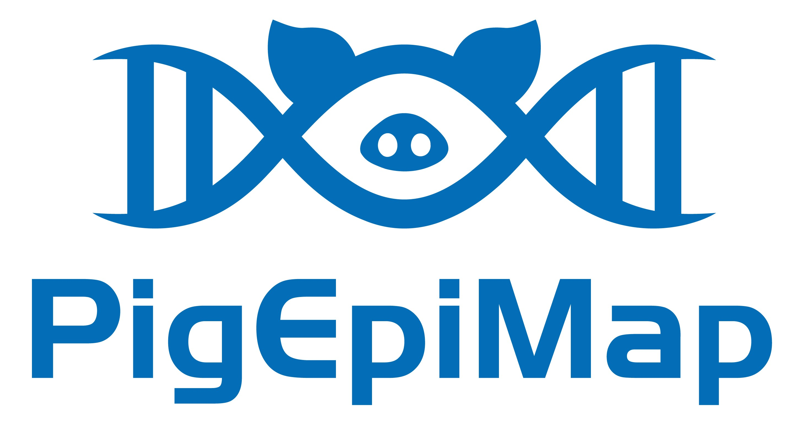

# PigEpiMap_pipeline_V0

# 🐖 PigEpiMap: A Multi-Tissue Epigenomic Atlas for Pig and Human Genetics

---

## 🌟 Overview

**PigEpiMap** is the first multi-tissue **epigenomic atlas** of the pig at a scale comparable to human flagship projects such as **Roadmap Epigenomics**, **EpiMap**, and **EN-TEx**.

This project systematically catalogs:
- **2,726** high-quality ChIP-seq and ATAC-seq profiles
- Across **50 tissues and cell types**
- Covering over **370,000 regulatory elements**, **730,000 enhancer-gene pairs**, and **46,000 allele-specific variants**

🔬 It enables **cross-species regulatory inference**, **GWAS variant interpretation**, and **deep learning-based sequence modeling** to predict  regulatory activity.

---

## 🧬 Key Features

- ✅ **Genome-wide regulatory annotation**: 72,566 promoters, 298,591 enhancers
- 🔁 **3D enhancer-gene interactions**: Anchored by chromatin interaction and co-accessibility
- 🧬 **Allele-specific regulation**: 46,386 high-confidence AS-SNPs across tissues
- 🤖 **Deep learning model**: DNABERT-2 trained on pig data predicts human AS variants
- 🔍 **GWAS interpretation**: for both pig and human complex traits
- 🌍 **Comparative genomics**: Conserved TFs and sequence features across pig & human

---

## 🚀 Applications

### 🔬 Biomedical Research
- A **non-rodent reference** for human regulatory genomics
- Facilitating prioritization of noncoding variants in **human complex traits**
- Supports **future xenotransplantation research** (heart, liver, kidney)

### 🐖 Agricultural Genomics
- A foundation for **FarmGTEx**
- Enables **precision breeding**, genome editing
- Improves interpretation of **molecular QTLs (molQTLs)** in livestock

---

## 🔗 Useful Links

- 📄 **Publication**: *Coming soon in *
- 🌐 **Data Portal**: [https://pigepimap.farmgtex.org](https://pigepimap.farmgtex.org)
- 📁 **Download data**: via portal or request (see below)
- 📫 **Contact us**: (jingjinli1212@foxmail.com)

---

## 📖 Citation

waiting for publish

## 📬 Contact & Contributions

We welcome feedback and collaboration!  
Please open an issue or contact us via email: (jingjinli1212@foxmail.com)

---

